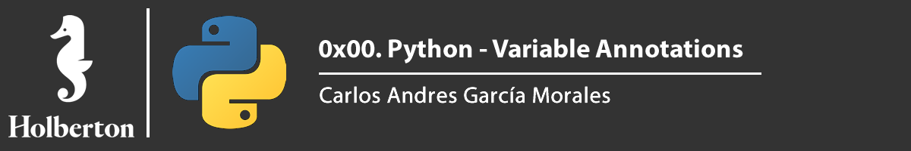




# Requirements

## General

> - Allowed editors: vi, vim, emacs
> - All your files will be interpreted/compiled on Ubuntu 18.04 LTS using python3 (version 3.7)(version 3.4.3)
> - All your files should end with a new line
> - The first line of all your files should be exactly #!/usr/bin/env python3
> - A README.md file, at the root of the folder of the project, is mandatory
> - Your code should use the pycodestyle style (version 2.5.)
> - All your files must be executable
> - The length of your files will be tested using wc
> - All your modules should have a documentation (python3 -c 'print(__import__("my_module").__doc__)')
> - All your classes should have a documentation (python3 -c 'print(__import__("my_module").MyClass.__doc__)')
> - All your functions (inside and outside a class) should have a documentation (python3 -c 'print(__import__("my_module").my_function.__doc__)' and python3 -c 'print(__import__("my_module").MyClass.my_function.__doc__)')


## Task

**0. Basic annotations - add**

File: [0-main.py](0-main.py/) - [0-add.py](0-add.py/)

Write a type-annotated function add that takes a float a and a float b as arguments and returns their sum as a float.

```sh
user:~/holbertonschool-web_back_end/0x00-python_variable_annotations$ cat 0-main.py
#!/usr/bin/env python3
add = __import__('0-add').add

print(add(1.11, 2.22) == 1.11 + 2.22)
print(add.__annotations__)

user:~/holbertonschool-web_back_end/0x00-python_variable_annotations$ ./0-main.py
True
{'a':  <class 'float'>, 'b': <class 'float'>, 'return': <class 'float'>}
```


**1. Basic annotations - concat**

File: [1-main.py](1-main.py/) - [1-concat.py](1-concat.py/)

Write a type-annotated function concat that takes a string str1 and a string str2 as arguments and returns a concatenated string

```sh
user:~/holbertonschool-web_back_end/0x00-python_variable_annotations$ cat 1-main.py
#!/usr/bin/env python3
concat = __import__('1-concat').concat

str1 = "egg"
str2 = "shell"

print(concat(str1, str2) == "{}{}".format(str1, str2))
print(concat.__annotations__)

user:~/holbertonschool-web_back_end/0x00-python_variable_annotations$ ./1-main.py
True
{'str1': <class 'str'>, 'str2': <class 'str'>, 'return': <class 'str'>}
```

**2. Basic annotations - floor**

File: [2-main.py](2-main.py/) - [2-floor.py](2-floor.py/)

Write a type-annotated function floor which takes a float n as argument and returns the floor of the float.

```sh
user:~/holbertonschool-web_back_end/0x00-python_variable_annotations$ cat 2-main.py
#!/usr/bin/env python3

import math

floor = __import__('2-floor').floor

ans = floor(3.14)

print(ans == math.floor(3.14))
print(floor.__annotations__)
print("floor(3.14) returns {}, which is a {}".format(ans, type(ans)))

user:~/holbertonschool-web_back_end/0x00-python_variable_annotations$ ./2-main.py
True
{'n': <class 'float'>, 'return': <class 'int'>}
floor(3.14) returns 3, which is a <class 'int'>
```

**3. Basic annotations - to string**

File: [3-main.py](3-main.py/) - [3-to_str.py](3-to_str.py/)

Write a type-annotated function to_str that takes a float n as argument and returns the string representation of the float.

```sh
user:~/holbertonschool-web_back_end/0x00-python_variable_annotations$ cat 3-main.py
#!/usr/bin/env python3
to_str = __import__('3-to_str').to_str

pi_str = to_str(3.14)
print(pi_str == str(3.14))
print(to_str.__annotations__)
print("to_str(3.14) returns {} which is a {}".format(pi_str, type(pi_str)))

user:~/holbertonschool-web_back_end/0x00-python_variable_annotations$ ./3-main.py
True
{'n': <class 'float'>, 'return': <class 'str'>}
to_str(3.14) returns 3.14, which is a <class 'str'>
```


**4. Define variables**

File: [4-main.py](4-main.py/) - [4-define_variables.py](4-define_variables.py/)

Define and annotate the following variables with the specified values:

- a, an integer with a value of 1
- pi, a float with a value of 3.14
- i_understand_annotations, a boolean with a value of True
- school, a string with a value of “Holberton”

```sh
user:~/holbertonschool-web_back_end/0x00-python_variable_annotations$ cat 4-main.py
#!/usr/bin/env python3

a = __import__('4-define_variables').a
pi = __import__('4-define_variables').pi
i_understand_annotations = __import__('4-define_variables').i_understand_annotations
school = __import__('4-define_variables').school

print("a is a {} with a value of {}".format(type(a), a))
print("pi is a {} with a value of {}".format(type(pi), pi))
print("i_understand_annotations is a {} with a value of {}".format(type(i_understand_annotations), i_understand_annotations))
print("school is a {} with a value of {}".format(type(school), school))

user:~/holbertonschool-web_back_end/0x00-python_variable_annotations$ ./4-main.py
a is a <class 'int'> with a value of 1
pi is a <class 'float'> with a value of 3.14
i_understand_annotations is a <class 'bool'> with a value of True
school is a <class 'str'> with a value of Holberton
```

**5. Complex types - list of floats**

File: [5-main.py](5-main.py/) - [5-sum_list.py](5-sum_list.py/)

Write a type-annotated function sum_list which takes a list input_list of floats as argument and returns their sum as a float.

```sh
user:~/holbertonschool-web_back_end/0x00-python_variable_annotations$ cat 5-main.py
#!/usr/bin/env python3

sum_list = __import__('5-sum_list').sum_list

floats = [3.14, 1.11, 2.22]
floats_sum = sum_list(floats)
print(floats_sum == sum(floats))
print(sum_list.__annotations__)
print("sum_list(floats) returns {} which is a {}".format(floats_sum, type(floats_sum)))

user:~/holbertonschool-web_back_end/0x00-python_variable_annotations$ ./5-main.py
True
{'input_list': typing.List[float], 'return': <class 'float'>}
sum_list(floats) returns 6.470000000000001 which is a <class 'float'>
```

**6. Complex types - mixed list**

File: [6-main.py](6-main.py/) - [6-sum_mixed_list.py](6-sum_mixed_list.py/)

Write a type-annotated function sum_mixed_list which takes a list mxd_lst of floats and integers and returns their sum as a float.

```sh
user:~/holbertonschool-web_back_end/0x00-python_variable_annotations$ cat 6-main.py
#!/usr/bin/env python3

sum_mixed_list = __import__('6-sum_mixed_list').sum_mixed_list

print(sum_mixed_list.__annotations__)
mixed = [5, 4, 3.14, 666, 0.99]
ans = sum_mixed_list(mixed)
print(ans == sum(mixed))
print("sum_mixed_list(mixed) returns {} which is a {}".format(ans, type(ans)))

user:~/holbertonschool-web_back_end/0x00-python_variable_annotations$ ./6-main.py
{'mxd_lst': typing.List[typing.Union[int, float]], 'return': <class 'float'>}
True
sum_mixed_list(mixed) returns 679.13 which is a <class 'float'>
```

**7. Complex types - string and int/float to tuple**

File: [7-main.py](7-main.py/) - [7-to_kv.py](7-to_kv.py/)

Write a type-annotated function to_kv that takes a string k and an int OR float v as arguments and returns a tuple. The first element of the tuple is the string k. The second element is the square of the int/float v and should be annotated as a float.

```sh
user:~/holbertonschool-web_back_end/0x00-python_variable_annotations$ cat 7-main.py
#!/usr/bin/env python3

to_kv = __import__('7-to_kv').to_kv

print(to_kv.__annotations__)
print(to_kv("eggs", 3))
print(to_kv("school", 0.02))

user:~/holbertonschool-web_back_end/0x00-python_variable_annotations$ ./7-main.py
{'k': <class 'str'>, 'v': typing.Union[int, float], 'return': typing.Tuple[str, float]}
('eggs', 9)
('school', 0.0004)
```

**8. Complex types - functions**

File: [8-main.py](8-main.py/) - [8-make_multiplier.py](8-make_multiplier.py/)

Write a type-annotated function make_multiplier that takes a float multiplier as argument and returns a function that multiplies a float by multiplier.

```sh
user:~/holbertonschool-web_back_end/0x00-python_variable_annotations$ cat 8-main.py
#!/usr/bin/env python3

make_multiplier = __import__('8-make_multiplier').make_multiplier
print(make_multiplier.__annotations__)
fun = make_multiplier(2.22)
print("{}".format(fun(2.22)))

user:~/holbertonschool-web_back_end/0x00-python_variable_annotations$ ./8-main.py
{'multiplier': <class 'float'>, 'return': typing.Callable[[float], float]}
4.928400000000001
```

**9. Let's duck type an iterable object**

File: [9-main.py](9-main.py/) - [9-element_length.py](9-element_length.py/)

```sh
Annotate the below function’s parameters and return values with the appropriate types

def element_length(lst):
    return [(i, len(i)) for i in lst]
vagrant@ubuntu-bionic:~/curriculum-specialization-backend/0x00-Python_variable_annotations$ cat 9-main.py 
#!/usr/bin/env python3

element_length =  __import__('9-element_length').element_length

print(element_length.__annotations__)

vagrant@ubuntu-bionic:~/curriculum-specialization-backend/0x00-Python_variable_annotations$ ./9-main.py 
{'lst': typing.Iterable[typing.Sequence], 'return': typing.List[typing.Tuple[typing.Sequence, int]]}
```

**10. Duck typing - first element of a sequence**

File: [100-main.py](100-main.py/) - [100-safe_first_element.py](100-safe_first_element.py/)

```sh
Augment the following code with the correct duck-typed annotations:

# The types of the elements of the input are not know
def safe_first_element(lst):
    if lst:
        return lst[0]
    else:
        return None
```

Test

```sh
user:~/curriculum-specialization-backend/0x00-Python_variable_annotations$ cat 100-main.py 
#!/usr/bin/env python3

safe_first_element =  __import__('100-safe_first_element').safe_first_element

print(safe_first_element.__annotations__)

user:~/curriculum-specialization-backend/0x00-Python_variable_annotations$ ./100-main.py 
{'lst': typing.Sequence[typing.Any], 'return': typing.Union[typing.Any, NoneType]}
```

**11. More involved type annotations**

File: [101-main.py](101-main.py/) - [101-safely_get_value.py](101-safely_get_value.py/)

```sh
Given the parameters and the return values, add type annotations to the function

Hint: look into TypeVar

def safely_get_value(dct, key, default = None):
    if key in dct:
        return dct[key]
    else:
        return default
```

Test

```sh
vagrant@ubuntu-bionic:~/curriculum-specialization-backend/0x00-Python_variable_annotations$ cat 101-main.py 
#!/usr/bin/env python3

safely_get_value = __import__('101-safely_get_value').safely_get_value
annotations = safely_get_value.__annotations__

print("Here's what the mappings should look like")
for k, v in annotations.items():
    print( ("{}: {}".format(k, v)))

vagrant@ubuntu-bionic:~/curriculum-specialization-backend/0x00-Python_variable_annotations$ ./101-main.py 
Here's what the mappings should look like
dct: typing.Mapping
key: typing.Any
default: typing.Union[~T, NoneType]
return: typing.Union[typing.Any, ~T]
```

**12. Type Checking**

File: [102-main.py](102-main.py/) - [102-type_checking.py](102-type_checking.py/)

```sh
Use mypy to validate the following piece of code and apply any necessary changes.

def zoom_array(lst: Tuple, factor: int = 2) -> Tuple:
    zoomed_in: Tuple = [
        item for item in lst
        for i in range(factor)
    ]
    return zoomed_in


array = [12, 72, 91]

zoom_2x = zoom_array(array)

zoom_3x = zoom_array(array, 3.0)
```

Test

```sh
user:~/curriculum-specialization-backend/0x00-Python_variable_annotations$ mypy 102-type_checking.py
Success: no issues found in 1 source file
user:~/curriculum-specialization-backend/0x00-Python_variable_annotations$ cat 102-main.py 
#!/usr/bin/env python3

zoom_array =  __import__('102-type_checking').zoom_array

print(zoom_array.__annotations__)

user:~/curriculum-specialization-backend/0x00-Python_variable_annotations$ ./102-main.py 
{'lst': typing.Tuple, 'factor': <class 'int'>, 'return': typing.List}
```
