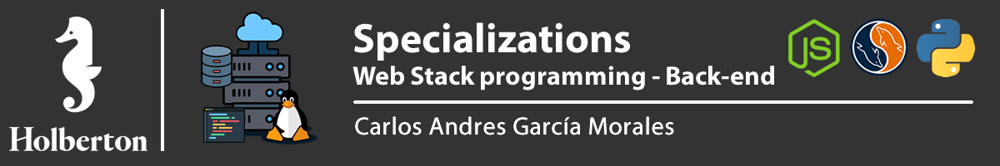



## :orange_book: Web Stack Introduction

A web stack is a compilation of software applications, often needed for web development, especially for developing web applications and implementing websites. A web stack is a type of solution stack, which is a collection of software for performing specific tasks. Web stacks are critical components for web applications as well as websites.

A web stack is also known as a web application stack.

### What is BackEnd

Backend is the data access layer of a software or any device, which is not directly accessible by users, it also contains the logic of the application that handles said data. The Backend also accesses the server, which is a specialized application that understands how the browser requests things.

Some of the Backend programming languages are Python, PHP, Ruby, C # and Java, and as in Frontend, each of the above has different frameworks that allow you to work better according to the project you are developing, such as Laravel, Django , rails, etc

## :books: Content

- [0x00-python_variable_annotations](/0x00-python_variable_annotations)

## :sagittarius: Author

> :man: Carlos Andres Garcia Morales

> :e-mail: [E-mail](agzsoftsi@gmail.com)

> :octocat: [Github](https://github.com/agzsoftsi)

> :bird: [Twiiter](https://twitter.com/karlgarmor)

> :blue_book: [Linkedin](https://twitter.com/karlgarmor)

> :globe_with_meridians: [WebPage](https://www.agzsoftsi.tech/)

